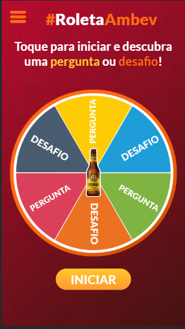

## Megahack 3.0 - Desafio Ambev

Projeto desenvolvido para o desafio do Megahack 3.0 promovido pela Shawee em parceira com diversas empresas, dentre essas a AMBEV.

A solução desenvolvida visa aumentar a interatividade das pessoas nos bares após a quarentena, através de um mini game de Perguntas e desafios

O frontend do projeto foi desenvolvido utilizado React JS, e o backend com Node JS, link abaixo:

*[backend roleta](https://github.com/SistemasSouza/roleta-backend)*

## Executando o projeto

- 1º Passo - Clonar o repositório do projeto

- 2º Passo - executar na linha de comando `yarn` ou `npm install` para que todas as dependências do projeto sem recuperadas.

- 3º Passo - execute o seguinte comando para inicar o projeto `yarn start` ou `npm start`, o servidor iniciará no seguinte endereço `http://localhost:3000`

## A Aplicação 

Home 

Pergunta

